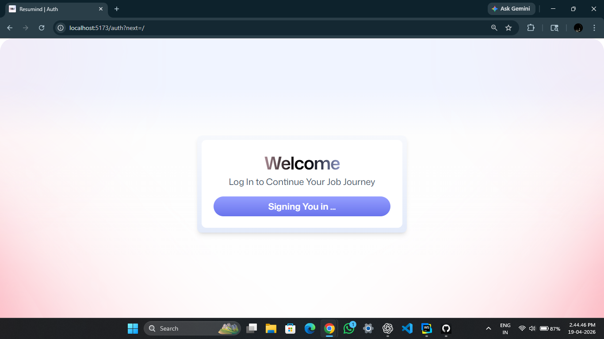
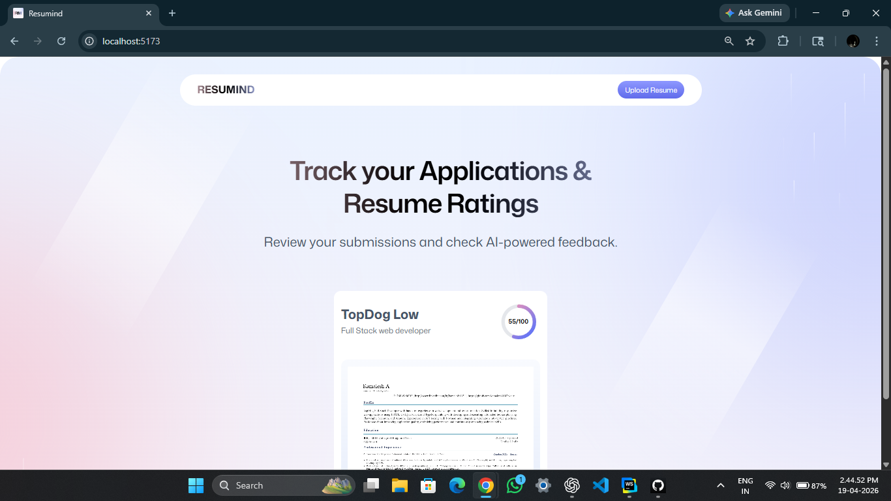
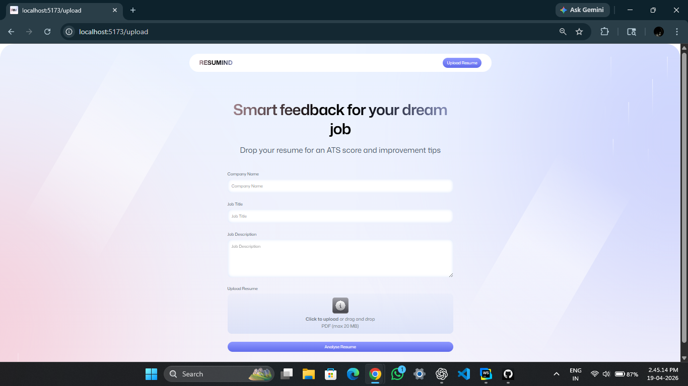
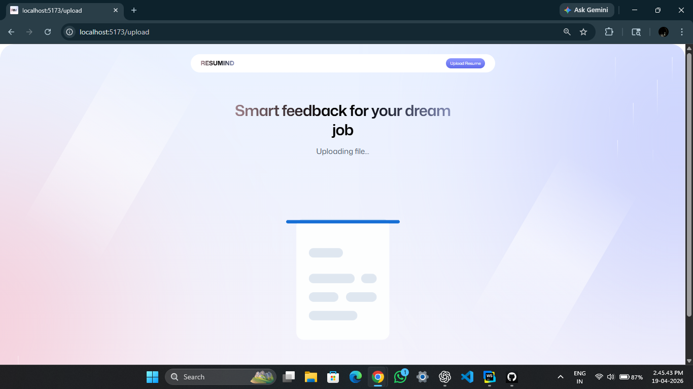
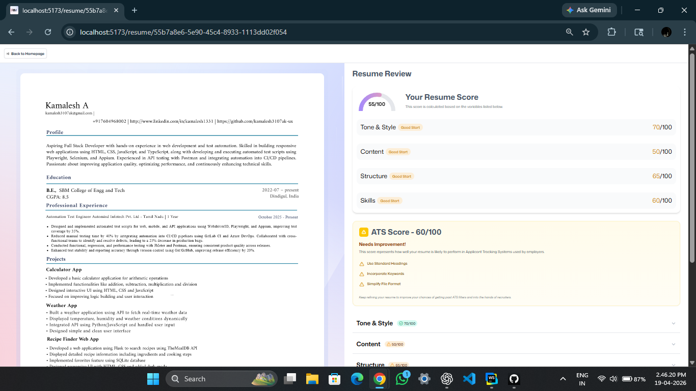
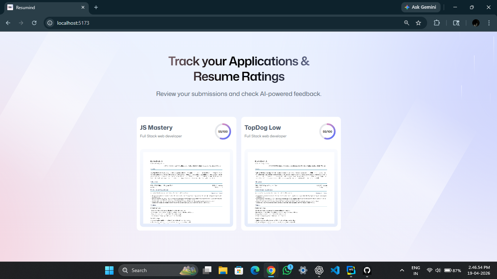

# 🤖 AI Resume Analyzer (Resumind)


<p align="center">
  
</p>

> 🚀 AI-powered platform to analyze resumes, calculate ATS scores, and provide smart improvement suggestions

---


> ☁️ Deployed and powered by Puter Cloud


---

## 📸 Screenshots

### 🔐 Authentication



### 🏠 Dashboard



### 📤 Upload Resume (Drag & Drop)



### ⏳ Processing State



### 📊 Resume Analysis & ATS Score



### 📁 Resume History / Multiple Reports



---

## ⚡ Features

* 📄 Upload resume (PDF)
* 🖱️ Drag & drop resume upload
* 🤖 AI-powered resume analysis
* 📊 ATS score calculation
* 📈 Graphical analytics (charts)
* 📝 Smart feedback & improvement tips
* 👤 User authentication (login/signup)
* 📁 Resume history dashboard (user-specific data)
* ⚡ Fast & responsive UI

---

## 🧠 How It Works

1. User logs in securely
2. Uploads resume (PDF)
3. Resume is processed & analyzed using AI
4. ATS score is generated
5. Detailed feedback is shown
6. Results are stored in dashboard

---

## 🛠️ Tech Stack

| Category       | Technology               |
| -------------- | ------------------------ |
| Frontend       | React + TypeScript       |
| Routing        | React Router             |
| Styling        | Tailwind CSS             |
| AI Processing  | Puter AI                 |
| Storage        | Puter KV (Cloud Storage) |
| Authentication | Puter Auth               |
| Platform       | Puter Cloud              |
| PDF Handling   | PDF → Image Conversion   |

---

## 📂 Project Structure

```
AI-resume-analyzer/
│
├── app/                # Core app logic
├── src/                # Components & pages
├── public/             # Static assets
├── types/              # Type definitions
├── Dockerfile          # Docker setup
├── package.json
└── README.md
```

---

## 🧑‍💻 Run Locally

```bash
npm install
npm run dev
```

👉 Open: http://localhost:5173

---

## 🐳 Docker Setup

```bash
docker build -t ai-resume-analyzer .
docker run -p 3000:3000 ai-resume-analyzer
```

---

## 📦 Build for Production

```bash
npm run build
```

---

## 🧩 Challenges Faced

* PDF to image conversion
* AI response optimization
* Async state management
* UI/UX refinement

---

## 🏆 What I Learned

* Building real-world AI applications
* Working with cloud storage & authentication
* Handling multi-user data securely
* Designing clean, responsive UI
* Debugging production-level issues

---

## 🚀 Future Improvements

* 📥 Downloadable PDF report
* 🌐 Multi-language support
* 🧠 Advanced AI scoring model
* 📊 Resume comparison feature

---

## 👨‍💻 Author

**A. Kamalesh**

🔗 GitHub: https://github.com/kamalesh3107ak-ux

---

## 🌟 Support

If you like this project:

⭐ Star the repo
🍴 Fork it
📢 Share it

---

## 💡 Quote

> “A great resume opens doors. A smart resume gets you hired.”
